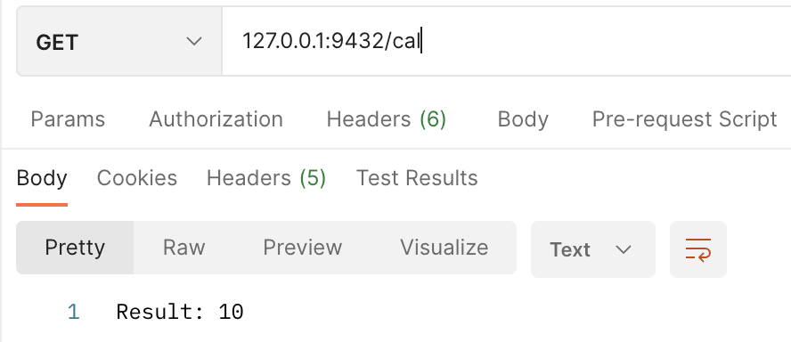
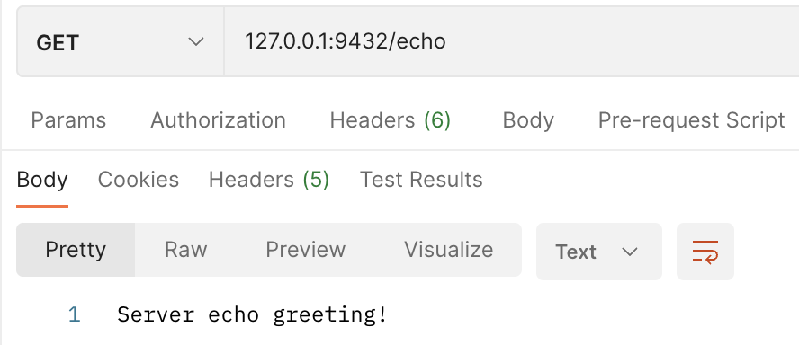

```                           
  _____                
 |__  /_ __ _ __   ___ 
   / /| '__| '_ \ / __|
  / /_| |  | |_) | (__ 
 /____|_|  | .__/ \___|
           |_|               
```
## 在Springboot中集成Zrpc
- 启动Zookeeper 默认端口为2181
```shell
cd ZOOKEEPER_ROOT_PATH
bin/zkServer.sh start
```
- 运行manager模块下的ManagerApplication在zookeeper下创建基础持久节点。

```java
public class ManagerApplication {

    public static void main(String[] args) {
        ZooKeeper zooKeeper = ZookeeperUtil.createZookeeperConnection();
        // 定义持久节点和数据
        ZooKeeperNode baseNode = new ZooKeeperNode(BASE_PATH, null);
        ZooKeeperNode providersNode = new ZooKeeperNode(getBaseProvidersPath(), null);
        ZooKeeperNode clientsNode = new ZooKeeperNode(getBaseClientsPath(), null);
        // 创建持久节点
        List.of(baseNode, providersNode, clientsNode).forEach(node -> ZookeeperUtil.createNode(zooKeeper, node, null, CreateMode.PERSISTENT));
        ZookeeperUtil.close(zooKeeper);
    }
}
```

### 服务端

- 启动Zookeeper 默认端口为2181
```shell
cd ZOOKEEPER_ROOT_PATH
bin/zkServer.sh start
```
- 使用@EnableZrpc注解开启Rpc远程调用，basePackages为接口实现所在的包
```java
@SpringBootApplication
@ComponentScan("com.sdu")
@EnableZrpc(basePackages = "com.sdu.provider.impl")
public class SpringProviderApplication {

    public static void main(String[] args) {
        SpringApplication.run(SpringProviderApplication.class, args);
    }
}
```

- 在接口实现类上使用@RpcService声明这是一个远程调用服务。

可以添加参数application指定服务的应用名和该类接口的根路径path。

在每一个接口的实现上，使用@RpcMapping注解声明接口的子路径，如果同一路径不可以被声明两次或多次
```java
@RpcService(application = "p1", path = "/test")
public class GreetImpl {

    @RpcMapping(path = "/echo")
    public String greet(String message) {
        return "Server echo greeting!";
    }

    @RpcMapping(path = "/cal")
    public String cal(int a, int b) {
        int c = a + b;
        return "Result: " + c;
    }
}
```
此时，GreetImpl下的greet方法会被注册到Zookeeper到临时节点上，路径为/zrpc-metadata/providers/p1/test.echo/xxx.xxx.xxx.xxx:${PORT}
此时，GreetImpl下的cal方法会被注册到Zookeeper到临时节点上，路径为/zrpc-metadata/providers/p1/test.cal/xxx.xxx.xxx.xxx:${PORT}

### 客户端
- 启动Zookeeper 默认端口为2181
```shell
cd ZOOKEEPER_ROOT_PATH
bin/zkServer.sh start
```
- 在启动类加上@EnableAspectJAutoProxy注解
```java
@SpringBootApplication
@ComponentScan("com.sdu")
@EnableAspectJAutoProxy
public class SpringClientApplication {
    public static void main(String[] args) {
        SpringApplication.run(SpringClientApplication.class, args);
    }
}
```

- 创建一个接口类，比如RpcClient。

在类上使用注解```@RpcClient(application = "p1", path = "/test")```
表示在该类下声明了远程调用的应用名"p1"和调用服务的根路径"/test"。

声明一个接口：greet，在该接口上使用@RpcMapping(path = "/echo")注解，表示将该方法映射到远程p1服务的/test/echo路径下。

可以声明多个接口，保证每个接口的路径唯一。

完整的RpcClient接口代码如下：
```java
@RpcClient(application = "p1", path = "/test")
public interface RpcClient {

    @RpcMapping(path = "/echo")
    String greet(String message);

    @RpcMapping(path = "/cal")
    String cal(int a, int b);
}
```

- 接口调用

使用@RpcProxy注解声明一个Rpc客户端，调用接口的具体方法。完整代码如下：
```java
@RestController
@Slf4j
public class TestController {

    @RpcProxy
    public RpcClient client;

    @RequestMapping(value = "/echo", method = RequestMethod.GET)
    public String greet() {
        return client.greet("Client say hi");
    }

    @RequestMapping(value = "/cal", method = RequestMethod.GET)
    public String cal() {
        return client.cal(5, 5);
    }
}
```

### 测试接口
- 测试/cal接口


- 测试/echo接口



## 通信架构

### 通信层

负责处理网络通信，实现请求的传输和响应的接收。我们选择使用TCP协议进行通信，使用Netty作为网络库。

[客户端如何优雅连接Netty](./docs/client.md)

### 序列化层

负责将请求和响应进行序列化和反序列化，使其在网络传输中进行编码和解码。我们提供了支持常见序列化方式（如jdk，JSON、Hessian）的插件机制，同时也支持自定义序列化方式。

[如何抽象序列化和压缩工厂](./docs/ser_com.md)

### 服务注册与发现层

负责服务的注册和发现，使客户端可以通过服务名称来发现可用的服务节点。我们使用一个中心化的服务注册中心来管理服务的注册和发现。

[服务提供方和使用方如何优雅配置注册中心](./docs/register.md)

### 负载均衡层

负责将请求合理地分配给服务节点，实现负载均衡。我们支持常见的负载均衡策略，如随机、轮询、加权等。

[如何优雅实现多种负载均衡器](./docs/loadbalance.md)

### 远程代理

在客户端和服务端实现远程代理，封装远程调用的细节，使开发者可以像本地调用一样调用远程服务。

[服务提供方如何通过反射调用具体实现的方法](./docs/reflect.md)

### 熔断限流

要保证服务的稳定性和高可用性，这时我们就需要业务进行自我保护，从而保证在高访问量、高并发的场景下，应用系统依然稳定，服务依然高可用。

[服务提供方和调用方如何实现熔断限流](./docs/fusing_and_current_limiting.md)

## 架构设计

### 服务端架构

服务端架构包括以下组件：

- 远程调用处理器：接收来自客户端的请求，根据请求的接口和方法调用相应的服务实现代码，并将结果返回给客户端。
- 序列化器：将请求和响应进行序列化和反序列化，使其能够在网络中进行传输。我们提供了可配置的插件机制，支持多种序列化方式。
- 通信模块：使用TCP协议进行网络通信，接收客户端的请求，并发送服务节点的响应。

[Spring服务端如何声明接口](./docs/spring-provider.md)

### 客户端架构

客户端架构包括以下组件：

- 远程代理：根据用户定义的接口，生成代理对象，封装远程调用的细节，将本地方法调用转化为远程调用。
- 序列化器：将请求和响应进行序列化和反序列化，使其能够在网络中进行传输。我们提供了可配置的插件机制，支持多种序列化方式。
- 负载均衡器：根据负载均衡策略选择合适的服务节点，将请求发送给服务节点。
- 通信模块：使用TCP协议进行网络通信，接收服务节点的响应。

[Spring客户端如何声明接口](./docs/spring-client.md)

### 注册中心架构

注册中心是中心化的服务注册与发现的管理节点，负责记录和管理可用的服务节点信息，包括服务名称、地址、权重等。客户端和服务端都可以通过注册中心来发现和注册服务。

### 工作流程

1. 客户端通过远程代理对象调用远程服务。
2. 远程代理将方法调用转化为RPC请求，使用负载均衡策略选择服务节点，并将请求发送给服务节点。
3. 服务节点接收到请求后，使用序列化器对请求进行反序列化，找到对应的服务实现代码，并调用相应的方法。
4. 服务实现完成后，将结果返回给服务节点。
5. 服务节点使用序列化器对结果进行序列化，并将结果发送给客户端。
6. 客户端接收到响应后，使用序列化器对响应进行反序列化，并将结果返回给用户。

### 扩展性和可靠性

框架具有良好的扩展性和可靠性。以下是一些关键设计:

- 插件机制：我们**使用插件机制来支持多种序列化方式和负载均衡策略**。开发者可以根据自己的需求实现自定义插件，来支持其他的序列化方式或负载均衡策略。
- 服务注册中心：使用中心化的服务注册中心来管理服务的注册和发现，提供可靠的服务节点信息。注册中心可以实现高可用以确保系统的可靠性和稳定性。
- 异常处理：我们的框架会对**网络异常、超时等情况进行处理，提供合适的错误信息和异常处理机制**，以保证框架的可靠性。
- 日志和监控：框架会记录关键的日志信息，方便开发者定位和解决问题。此外，我们也提供监控和性能统计功能，供开发者进行系统性能分析和优化。

## 协议定义

### Header

- ```Magic Number 4B```：魔数，用于识别该协议 例如：0xspar
- ```Version 1B```：协议版本号
- ```Header Length 4B```：Header部分的长度
- ```Body Length 4B```：Body部分的长度
- ```MessageType 1B```：消息类型，例如：0x01表示请求，0x02表示响应
- ```Serialization Type 1B```：序列化方法，例如0x01表示JSON，0x02表示Protobuf
- ```Compression Type 1B```：压缩方法
- ```RequestId 8B```：请求Id，用于标识请求和响应的匹配。
- ```TimeStamp 8B```：时间戳

### Payload

Payload的结构取决于具体的请求或响应的数据

#### 对于请求，Payload可以应以下字段

- Service Name：被调用服务的名称
- Method Name：被调用方法的名称
- Method Arguments：被调用方法的参数列表
- Method Argument Types：被调用方法参数的类型列表
- Return Type：调用返回的类型

#### 对于响应，Payload可以应以下字段

- Status Code：响应状态码，例如0x00表示成功，0x01表示失败
- Error Message：错误信息
- Return Value：方法返回值

[分布式全局唯一ID解决方案](./docs/snowflake.md)

[如何感知服务动态上下线](./docs/up_and_down.md)